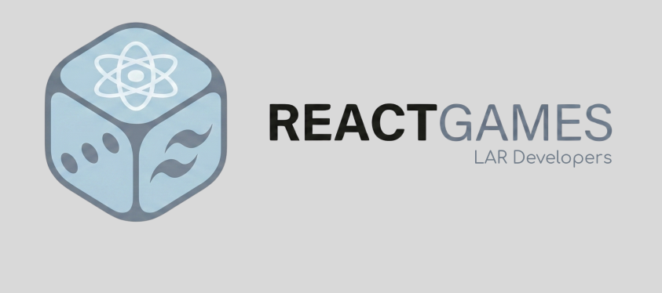
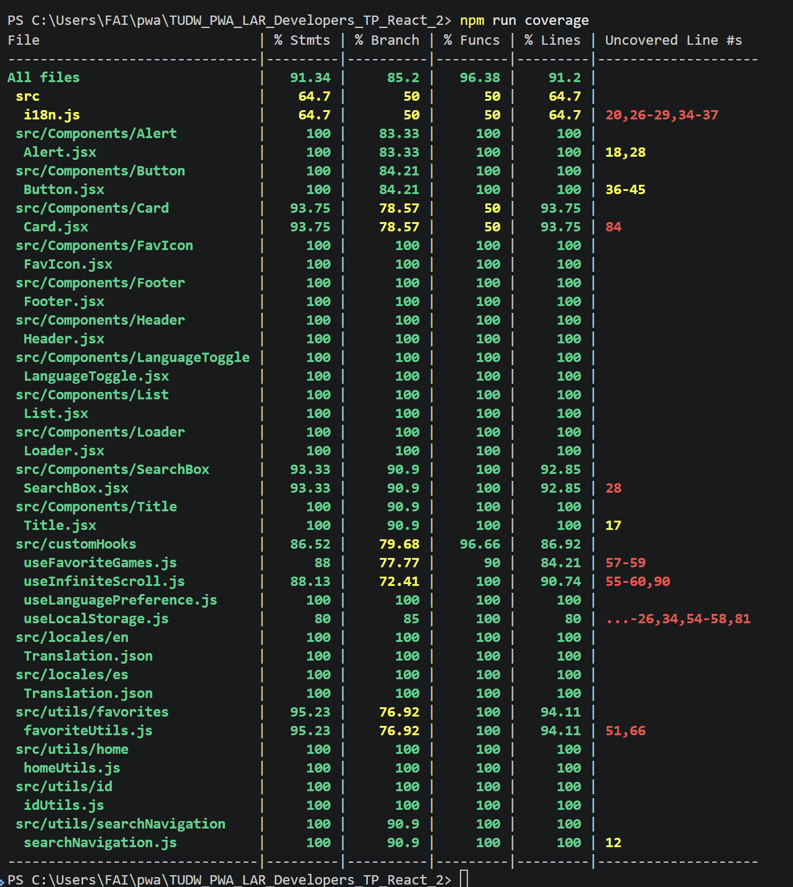
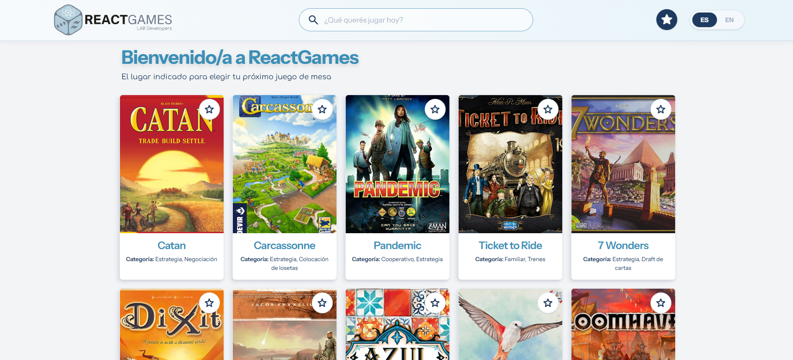
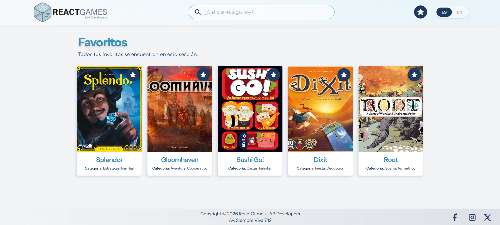
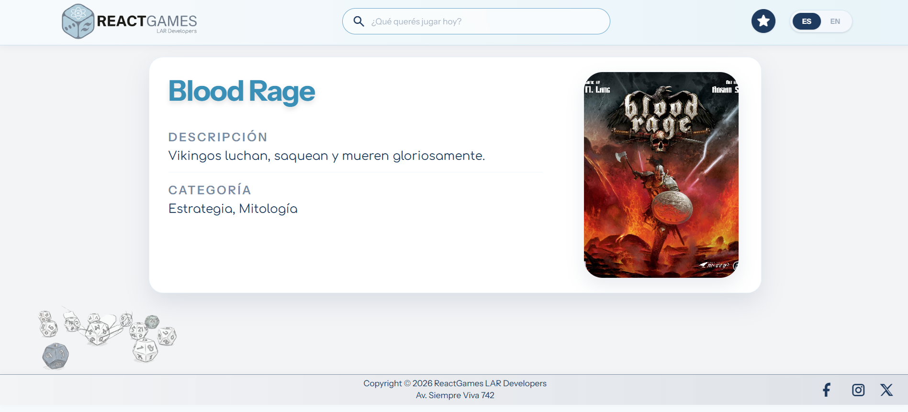
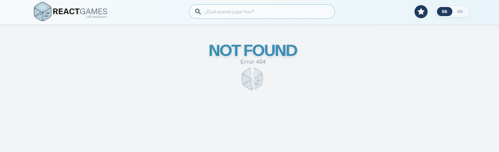

# REACT GAMES - Tu Ludoteca Digital

## Programación Web Avanzada (TUDW)

- **Trabajo Práctico** REACT Parte II: Desarrollo de una Aplicación con Múltiples Páginas

**Integrantes:**
- Project Manager: Ramiro Navarrete — FAI-5522
- Developer: Linda Cristal Parra Sanhueza — FAI-5568
- Developer: Andrea Crespillo — FAI-5546


## Descripción

Aplicación web desarrollada con React y Vite que permite buscar, explorar y marcar juegos de mesa como favoritos. Incluye soporte de idiomas (es/en), scroll infinito y detalle de ítems.

## Características principales

- Búsqueda de juegos
- Listado con scroll infinito
- Favoritos persistentes en `localStorage`
- Vista detallada de un juego
- Selector de idioma (es / en)

## Instalación y ejecución (paso a paso)

1. Clonar el repositorio:

```
git clone https://github.com/nramiror/TUDW_PWA_LAR_Developers_TP_React_2.git
cd TUDW_PWA_LAR_Developers_TP_React_2
```

2. Instalar dependencias:

```
npm install
```

3. Ejecutar en modo desarrollo (Vite):

```
npm run dev
```

4. Construir versión de producción:

```
npm run build
```

## Testing

Los tests están desarrollados con **Vitest** y **React Testing Library**. Para ver además el reporte de cobertura usamos el comando de coverage de Vitest.

### Ejecutar tests

**Modo watch** (se ejecutan automáticamente cuando cambias archivos):

```
npm test
```

**Ejecutar tests una sola vez:**

```
npm run test:run
```

**Ejecutar tests con coverage:**

```
npm run coverage
```

### Cobertura de tests

El proyecto incluye tests para:
- **Componentes** (Header, Footer, Card, Button, Alert, etc.)
- **Custom Hooks** (useInfiniteScroll, useFavoriteGames, useLanguagePreference, useLocalStorage)
- **Utilidades** (favoriteUtils, homeUtils, idUtils, searchNavigation)

**Reporte actual:**


## Capturas de pantalla
Home.

Favorites.

Detail.

NotFound.


## Estructura relevante del proyecto

**Archivos principales:**
- `src/App.jsx` : componente raíz, maneja routing y estado global de la app
- `src/main.jsx` : punto de entrada de la aplicación
- `src/index.css` : estilos globales de la aplicación
- `src/i18n.js` : configuración de internacionalización con i18next

**Carpetas por funcionalidad:**
- `src/Pages/` : vistas principales (`Home`, `Favorites`, `ItemDetail`, `NotFound`)
- `src/Components/` : componentes reutilizables (Header, Footer, List, SearchBox, Card, Button, etc.)
- `src/services/boardgames.js` : llamadas a la API simulada y lógica de datos
- `src/customHooks/` : hooks personalizados (`useFavoriteGames`, `useInfiniteScroll`, `useLanguagePreference`, `useLocalStorage`)
- `src/locales/` : archivos de traducción (español e inglés)
  - `es/Translation.json` : textos en español
  - `en/Translation.json` : textos en inglés

## Tecnologías

- React
- Vite
- i18next
- localStorage para favoritos

